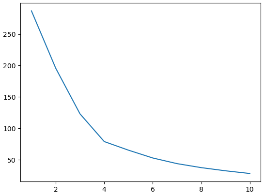
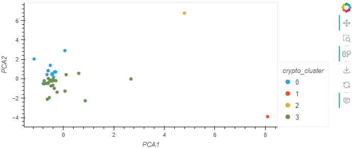

# CryptoClustering
Module 11 Challenge  CryptoClustering

In this Challenge, we will use apply the undrestanding of the K-means algorithm and principal component analysis (PCA) to cryptocurrencies data to group them for classification according to their price fluctuations across various timeframes. We will examine price changes over interveals spanning **24 hrs**, **7** days, **30** days, **60** days, **200** days, and **1** year.

## Overview

Importing necessary libraries and dependencies, we will preprocess the data, reduce the dimensions of the data using PCA, and cluster the cryptocurrencies using the K-means algorithm. We will then visualize the results and analyze the findings.

## Resources
- Data Source: `crypto_data.csv`
- Software: Python 3.7.6, Anaconda 4.8.3, Jupyter Notebook 6.0.3, scikit-learn, hvplot, plotly, pandas, numpy, and Pathlib.

## Analysis
### Preprocessing the Data for PCA

First we will import data from the `crypto_data.csv` file and normalize the dataset. We will then use the `PCA` algorithm to reduce the dimensions of the `X` DataFrame to three principal components. We will set the index to the `coin_id`. These are the first few rows of the resulting DataFrame:

### Finding the Best Value for k Using the Original Scaled DataFrame

We will use the elbow method to find the best value for `k` from the `pcs_df` DataFrame. We will then create an elbow curve using `plot` to visualize the results. The elbow curve will look like this:

### Clustering Cryptocurrencies Using K-means using original scaled data

We will initialize the K-means model with the `k` value that we found earlier. We will then predict the clusters for the cryptocurrencies data. We will create a new DataFrame named `clustered_df`, which includes the following columns: `price_change_percentage_24h`, `price_change_percentage_7d`, `price_change_percentage_30d`, `price_change_percentage_60d`, `price_change_percentage_200d`, `price_change_percentage_1y`. We will create a scatter plot using panda plot to visualize the clusters using `price_change_percentage_24h` as x-axis and `price_change_percentage_7d` as y-axis. The scatter plot will look like this:

### Optimizing Clusters Using Principal Component Analysis

We will use the `PCA` algorithm from `sklearn` to reduce the dimensions of the `X` DataFrame to three principal components. We will then initialize the K-means model with the `k` value that we found earlier. We will predict the clusters for the cryptocurrencies data. From this we find the best value for K is `4`.

### Cluster the Cryptocurrencies with K-Means by Using the PCA Data

Since we already have the best value for `k = 4`, We will use this to create number of clusters. We will Fit and Predict the model. Using `hvplot` we will create scattered plot.

